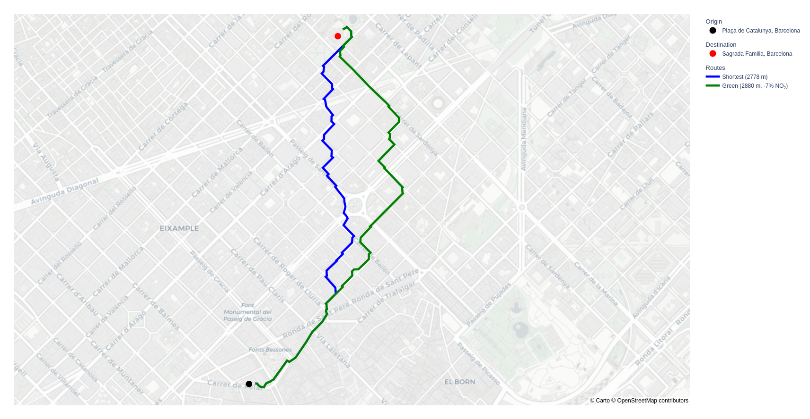
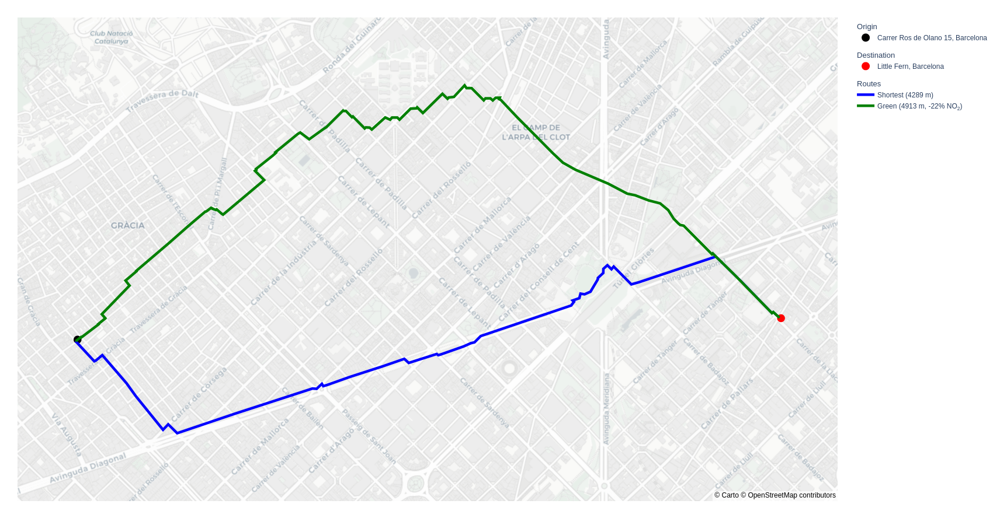

Compute Green Routes that Minimize the Exposure to Air Pollutants (NO2, PM2.5, PM10)
===================
This repository contains a prototype application recommending green routes for pedestrians that minimize the exposure to air pollutants, comparing the total distance and the total exposure with the shortest route computed in the classical way. This prototype implements some of the techniques presented by Sergio Calo, Filippo Bistaffa, Anders Jonsson, Vicenç Gómez, and Mar Viana in “[Spatial Air Quality Prediction in Urban Areas via Message Passing](https://www.sciencedirect.com/science/article/pii/S095219762400349X/pdfft?md5=7400987ed4288d5f46285fb2725d3efc&pid=1-s2.0-S095219762400349X-main.pdf)”, Engineering Applications of Artificial Intelligence (EAAI), DOI: [10.1016/j.engappai.2024.108191](https://doi.org/10.1016/j.engappai.2024.108191).

Dataset
----------
This prototype employs the most up-to-date (2022) [historical air quality data](https://ajuntament.barcelona.cat/mapes-dades-ambientals/qualitataire/es/) from the [Open Data BCN portal](https://opendata-ajuntament.barcelona.cat/data/ca/dataset/mapes-immissio-qualitat-aire) (see [`data`](data) folder) and [real-time data from air quality sensors in Barcelona](https://ajuntament.barcelona.cat/qualitataire/es). Real-time data can be fetched with the [`fetch_real_time_data.py`](data/fetch_real_time_data.py) script.

Dependencies
----------
Although not mandatory, running the project in a Python *virtual environment* is recommended:

    python3 -m venv demo
    source demo/bin/activate

Required dependencies can then be installed via `pip` with the following command:

    pip install --upgrade -r requirements.txt

Historical Data Preprocessing
----------
The historical data provided by Open Data BCN contains an AQI measurement for each edge of the [road graph published on the same portal](https://opendata-ajuntament.barcelona.cat/data/ca/dataset/mapa-graf-viari-carrers-wms). Since this project employs the much more detailed road graph from OpenStreetMap (OSM) via [`osmnx`](https://osmnx.readthedocs.io/en/stable/), it is necessary to assign an AQI value to each edge of the OSM graph. This is achieved first by assembling the data for [NO2](data/2022_tramer_no2_mapa_qualitat_aire_bcn.gpkg), [PM2.5](data/2022_tramer_pm2-5_mapa_qualitat_aire_bcn.gpkg), [PM10](data/2022_tramer_pm10_mapa_qualitat_aire_bcn.gpkg) into [one data source](data/2022_locations_aqi.csv) with [`process_historical_data.py`](data/process_historical_data.py) and then by assigning to each edge in the OSM road graph the value of the closest edge in the original road graph using a *Ball Tree* data structure for optimal efficiency (see [`precompute_graph.py`](data/precompute_graph.py)). The output is the [`2022_graph_aqi.pkl`](data/2022_graph_aqi.pkl) file that embeds all the necessary spatial and AQI information needed by [`green-route.py`](green-route.py).

Usage
----------

    usage: green-route.py [-h] [--origin ORIGIN] [--destination DESTINATION]
                          [--pollutant {no2,pm25,pm10}] [--historical HISTORICAL]
                          [--real-time REAL_TIME] [--sensor-radius SENSOR_RADIUS]
                          [--mamp-epochs MAMP_EPOCHS] [--export-json EXPORT_JSON]
                          [--map-style {open-street-map,carto-positron,carto-darkmatter}]
    
    options:
      -h, --help                     show this help message and exit
      --origin ORIGIN                address of origin point
      --destination DESTINATION      address of destination point
      --pollutant {no2,pm25,pm10}    pollutant to consider for air quality data
      --historical HISTORICAL        *.pkl file containing historical air quality data
      --real-time REAL_TIME          *.json file containing real-time air quality data
      --sensor-radius SENSOR_RADIUS  extend air quality value of each sensor to its
                                     neighbors (up to specified number of hops)
      --mamp-epochs MAMP_EPOCHS      number of epochs of the MAMP interpolation algorithm
      --export-json EXPORT_JSON      export results to *.json
      --map-style {open-street-map,carto-positron,carto-darkmatter}

Examples with Historical Data
----------
Input:

    python3 green-route.py --origin "Plaça de Catalunya" --destination "Sagrada Familia"

Output:

    Shortest route total distance: 2777.77 m
    Shortest route total exposure: 108216.09
    Green route (historical data) total distance: 2880.22 m
    Green route (historical data) total exposure: 100394.24
    NO2 exposure difference: -7.23%
    Distance difference: +3.69%

Input:

    python3 green-route.py --origin "Carrer Ros de Olano 15" --destination "Little Fern"

Output:

    Shortest route total distance: 4289.07 m
    Shortest route total exposure: 146715.41
    Green route (historical data) total distance: 4912.71 m
    Green route (historical data) total exposure: 114107.55
    NO2 exposure difference: -22.23%
    Distance difference: +14.54%

Examples with Historical Data + Real-Time Data
----------
Input:

    python3 green-route.py --origin "Carrer Ros de Olano 15" --destination "Avinguda Diagonal 482" --real-time data/test.json

Output:

    Running MAMP algorithm
    Shortest route total distance: 825.64 m
    Shortest route total exposure: 31655.12
    Green route (historical data) total distance: 825.64 m
    Green route (historical data) total exposure: 31655.12
    NO2 exposure difference: +0.00%
    Distance difference: +0.00%
    Green route (historical + real-time data) total distance: 844.01 m
    Green route (historical + real-time data) total exposure: 25331.26
    NO2 exposure difference: -19.98%
    Distance difference: +2.22%

Experiments with POIs in Barcelona
----------
We consider the following 10 turistic *Points of Interest* (POIs) in Barcelona:
1. Casa Batlló
2. Plaça de Catalunya
3. Platja del Bogatell
4. Sagrada Familia
5. Parc de la Ciutadella
6. Platja de la Barceloneta
7. Camp Nou
8. Estadi Olimpic
9. Recinte Modernista
10. Turó de la Rovira

We then consider all the ${10 \choose 2} = 45$ couples among the 10 above POIs and for each couple `(p1, p2)` we run `python3 green-route.py --origin p1 --destination p2`, considering historical data and NO2 as the pollutant (see [`compute-routes-pois.sh`](compute-routes-pois.sh)). Results can be found in the [`jsons`](jsons) folder.
